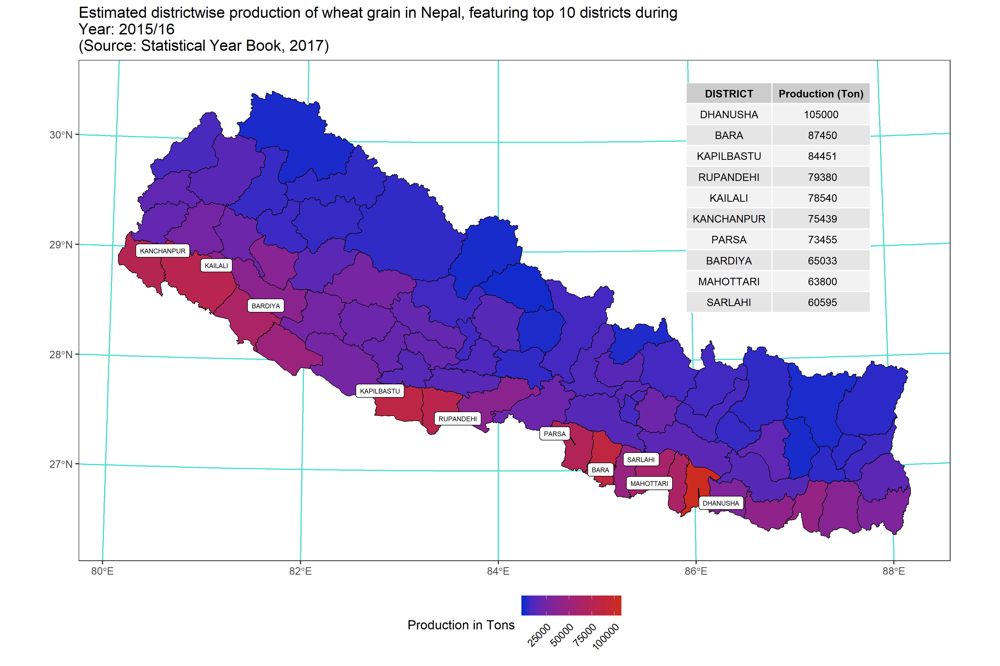

```{r setup, include=FALSE}
require(AER)
require(tidyverse)
require(forecast)
require(tsibble)
require(ggfortify)
require(fable)
require(fabletools)
require(tseries)
require(sf)
require(units)
# require(timetk)
# require(timeSeries)
# require(timeDate)
require(urca)
# require(rvest)
# require(rebus)
require(lubridate)
# install.packages("imputeTS") # useful for imputation
require(tsDyn)
theme_set(theme_bw())

options(knitr.kable.NA = '')
options(readr.default_locale=readr::locale(tz="Asia/Kathmandu"))
knitr::opts_chunk$set(tidy = FALSE, echo = FALSE, cache = TRUE, message = F, warning = F)
options(htmltools.dir.version = FALSE, 
        # knitr.table.format = "latex",
        kableExtra.latex.load_packages = FALSE)
```


```{r handy-functions}
# named group split (copied from: https://github.com/tidyverse/dplyr/issues/4223)
named_group_split <- function(.tbl, ...) {
  grouped <- group_by(.tbl, ...)
  names <- rlang::eval_bare(rlang::expr(paste(!!!group_keys(grouped), sep = " / ")))

  grouped %>% 
    group_split() %>% 
    rlang::set_names(names)
}

```

# Introduction

## Background

Agriculture is the source of employment and livelihood for approximately 65.6% of the population in Nepal (CBS, 2013/14). With 21 percent of total area under agricultural production, the sector contributes 27.1% percent to the total GDP of the country (MOAD, 2018). There is the dominance of small farmers in Nepalese agriculture and most of them are still following traditional system of farming using indigenous technologies. The population growth of Nepal is at the rate of 1.35 % per year (CBS, 2012). The increasing population along with decreasing amount of land utilization for agriculture purpose has led to food insufficiency in 12 districts of out of 75 in Nepal (MoAD, 2016). Increasing population coupled with declining agricultural land and stagnant productivity of major cereals has led to food and self-insufficiency in some districts of the country. Out of 75 districts 12 districts were reported to be experiencing food deficit (MoAD, 2016).  The main staple food crops of Nepal are rice, maize and wheat in terms of production and productivity. These three crops are vital for maintaining food security in the country. Still 21.6 percent people (more than 6 million) are below the poverty line (MOF, 2018; economic survey 2017/18).

Due to government lending special focus on priority commodities of agriculture sector in recent years, growth oriented agricultural transformation mechansism are on place. One of such reference document is the Agriculture Development Strategy (ADS), lauched for the period 2015-2035 AD. This strategy paper foresees country achieving independence in food and grain supply owing from domestic production [@moadads2014]. 

After rice and maize wheat is the third most important food crop in Nepal in terms of production and productivity. The total area covered by wheat in Nepal during FY 2017/18 was 7,06,843 ha with a total production of 19,49,001 metric tons and yield of 2.07 metric tons/ha (MOAD, 2018). Wheat is grown in winter season in terai, mid hills and high hills of Nepal during the month of October to July (CIMMYT, 2001). The average per capita consumption of wheat was 24.5 kg per person in fiscal year 2016 (GoN and UNDP, 2016). Therefore, it plays an important role in national food security. Nepal imported goods of value NRs 1.245 trillion in the fiscal year 2017-18, with an stark deficit factor of 15.3 times than the value generated by exported items (MOAD, 2018). Impaling an impression of agricultural economy, most of the import were that of fuel and food products. 

The wheat supply in Nepal depends mainly on domestic supply and from import. The domestic production of cereal grains alone is unable to meet the demand of the country as a result large amount of food is imported from neighboring countries, especially from India.

Wheat production is challenged by several factors like precipitation, incidence of disease, increase in mean maximum temperature and lack of improved technology. These are the main causes for production shortfalls that result in fluctuation in wheat supply.

The topography of Nepal is harsh and some places are away from the physical infrastructure like electricity, water, transportation. So, fuel price is another factor that affects agricultural commodity prices. The prices of fertilizer, farm machinery, and transportation are all affected by the fuel price, which influences wheat production costs. Transportation costs have been found to be important contributors to agricultural input use (Qin and Zhang 2016), agricultural productivity (Gollin and Rogerson 2014), and food prices (Minten and Kyle 1999; Goletti 1994).

Every year Nepal imports large amount of food crops from India to fulfil the demand of its increasing population and to stabilize domestic market price of food. In fiscal year 2017/18 the contribution of India alone in total import was 65.39 percent while 12.85 percent import was from China (MOAD, 2018). Out of total food import 99% takes place from India (MOF/DoC, 2018) as a result Nepalese wheat market might get affected from supply shocks from neighboring markets of India. This makes wheat price inherently volatile. 

Price instability of wheat in Nepal is mostly attributable to factors such as weather condition (temperature, drought, rainfall) natural contingencies (flood, landslide, and soil erosion), production side factors (cost of production, socioeconomic status of farmer, institutional facilities), political atmosphere and disease and pest infestation. In addition, wheat markets face uncertainties due to changes in demand and supply condition (due to variation in production quantity, import and export situation) and distance from the market (geographical locations).

Agricultural markets and market information are cardinal for effective participation of smallholder farmers in agricultural markets (Mawazo et al., 2014). Smallholder farmers have challenges to access market information such as the price of a commodity in the local markets (Ross and De Klerk, 2012). This affects the producers' capacity to participate in informed and profitable trade taking advantage of seasonal and spatial arbitrage.

In the face of murky economic gain policy, with respect to agriculture, and impoverished market information system that does not adequately account for the spatial price transmission (the degree to which the geographically separated markets share a common long run relationships of a commodity market), a study utilizing already available, albeit scattered market price information and related variables to describe state of the wheat food economy has certain benefits for macroeconomic policy adjustment. The study of such relationships provides valuable information on how much sensitive or otherwise is the price adjustment/arbitrage mechanism is, in a small economy such as ours, to work food market. In this study the extent of wheat market integrations of Nepal with world wheat market, bordering Indian wheat markets and across the districts of Nepal will be studied using individual commodity prices.

## Statement of problems

Production and consumption side factors, weather conditions, and acess to international and cross border market are postulated as wide-reaching determinants of agricultural commodity prices. There is a possibility that price shocks in india have a pronounced impact in wheat price of Nepal. 

The other major drive known to impact on commodity prices, through operations cost in agriculture, is fuel. Mainly, periods of high volatility in diesel prices might be linked to food price, the direct impact of which remains unexplored in wheat for Nepalese socio-economic scenario.

Moreover, price transmission of wheat markets is a scantly studied topic in reference to Nepal, and South East Asia generally, as much of the studies are focused in paddy/rice. Prevailing market information exchange system loosely accounts, if it does at all, for the cross border and international market prices mostly due to lack of formalized market integration model. Also for wheat, an appropriate demand-supply balancing model is yet to be identified for Nepal. Thus, the current study aims to fill the gap by evaluating the spatial integration and price transmission among geographically separated wheat markets in Nepal and with bordering markets of India and world wheat market. 

## Rationale

Commodity price instability are important issues that have received considerable attention by many policy makers and economists for decades. An important question is whether increased exposure to Indian markets reduces the domestic price volatility and thereby improves the welfare of agricultural households. Evidence on this issue can have a profound impact on policy implications to the countries adopting market liberalization policies of the type initiated during the 1990’s. India as the the largest trade partner having a prominent role in Nepalese food market seems is likely most important than with the world markets. This study further extends the research in price transmission by utilizing retail wheat market data across multiple -- import based and production based -- districts of Nepal, to major adjoining cities in India. In so doing, within-country transmission of price is also accounted for in current analysis framework.

Market integration is important to make goods (e.g., food grain) available and to keep price stable, because well-integrated markets assume that prices of comparable goods do not behave independently. Moreover, in well-integrated markets, price changes in one location are consistently related to price changes in other locations, in which market agents are able to interact among different markets.

The findings obtained from this study will go a long way in informing and facilitating development of better, meaningful and statistically significant economic model that will yield better estimates of the future behaviors of wheat prices. This will in effect shield the wheat grower farmers, farm workers, consumers and the nation at large from acute market downturns of the wheat price. Market integration model including well informed domestic and international price determinants will facilitate freer flow of wheat as well as allied cereal commodities in Nepal. It is expected that with the calibration of such model, it can be extended easily to other commodities as well -- given that reliable data are available.

Additionally, policy tools that can mark various domestic districts and households for vulnerability to price volatilities can be generated through price transmission model. For a small economy country such as Nepal where market integration with world is defined poorly, insights on degree of price transmission might help reduce trade imbalance and potentially highlight investment schemes that can reduce the extent of price and production variability. More integrated domestic market through would further enhance farmers' access to resources and lead to higher integration with regional and world markets, and thereby reduce income instability.

## Objective of research

# Literature review

Switching from an export to an import situation and vice versa always adds to the price volatility. High price volatility may lead to disbalances in the economy as a whole, low prices harm agricultural producers, thus discoraging grain production. While high prices threaten food security as about 16.4% of population in Nepal live on less than 1 usd per day (UNDP, 2015) and are thus vulnerable to food price increases.

{Since the world market prices are usually not volatile, there should be mechanisms in place to prevent large fluctuation in Nepalese wheat market, i.e. the Nepalese wheat market responds to world price changes as quickly and as fully as possible.

This paper will focus on the integration of the Nepalese wheat market with regional (Border Indian) and world (Canada) wheat markets.} --- included in introduction.

@sridharthapaspatial2019 conducted an analysis of market integration for cereal (rice and wheat) and pulse (lentil) crops in South asia. Monthly price data taken for the period Jan 2006 to April 2014 was tested for correlated variables and the differenced series was modeled with a linear equation for estimation of effects. Results showed that Indian and Nepalese markets are more strongly integrated than the markets of India and Bangladesh. Further, author demonstrates that regional market integration is better for rice and lentil than wheat. Author suggests usage of more robust price models which can effectively quantify the relationship between endogeneous market price series, such as Vector Autoregression or Vector Error Correction Model.

## Wheat market in Nepal

## International wheat market

Canada primarily produces a hard red spring wheat (Canadian Western Red Spring (CWRS)) and durum wheat. Average Canadian wheat production for the 2011-2015 period included 24.4 million tons of CWRS. 
The total wheat production in 2015 increased by 257% in India and by 205% in China compared to wheat production in the 1960s. The EU production increased by 193%, but a large share of that was due to the addition of countries to the EU. The United States and Canada increased production by 33% and 57%, respectively.

Until 1995, China had been the largest importer of wheat, followed by Brazil and Japan. However, China's wheat imports have been highly volatile, depending upon its domestic wheat production and import policies. China has reduced wheat imports substantially, and changed from importing 12.0 million tons in 1995 to importing 2.9 million metric tons of wheat in 2013 and 500 thousand metric tons in 2014.

## Price transmission

## Factors affecting wheat price in Nepal

### Precipitation

### Supply (producer side) and demand (consumer side) in domestic market

### Price of bordering region markets

### Foreign exchange rates

{The prices that producers receive once they are deflated into the currency of domestic producers may have a big impact on the prices at which they are prepared to sell. This also extends to holders of stocks. Volatile exchange rates increase the riskiness of returns, and thus it is expected that there may be a positive transmission of exchange rate volatility to the volatility of agricultural prices [@balcombe2010nature].} --copied.

### Fuel price

Empirical work by suggested a transmission of prices between oil and sugar prices (Balcombe and Rapsomanikis, 2005). There is also likely to be a strong link between input costs and output prices. Fertiliser prices, mechanised agriculture and freight costs are all dependent on oil prices, and will feed through into the prices of agricultural commodities. Acknowledging that the oil price has ran through high volatility over the past few years, it is very likely that this volatility will spill over to the volatility of commodity prices [@balcombe2010nature; @areal2016testing].

## Techniques for studying price transmission

# Methodology

<!-- ## Why domestic price is studied at district level -->

- Until recently, before federal structure of governance was into force, planning, budgeting, service delivery and policy interventions in Agriculture were all excised through district level bodies. Each district was itself accountable for market information accrual and reporting. Hence, most reliable form of price series data would be district level itself.
- Districts present isolated markets and well organized customer segments surrounding that. For e.g., food grain retail market of kathmandu is drastically different from that of kailali, because while in the former consumer segment has a larger role to play in determining of market demand, the market of farwestern terai region has significant share of producer segments in determining what and when to produce.
- District present different socio-economic narrative for food commodity trade which is heavily affected by the geographical context of the district itself. For e.g., Rupandehi market is more closely tied to bordering Indian market, because of minimal to none customs intervention in cross-country trade of food grain. The price effects of indian districts are more easily reflected in border region market prices, than in distant market such as Jumla and Surkhet. 
- District markets information systems are more organized than local level markets, mostly because there are factors that buffer price volatility in district level. For e.g., government intervene through subsidized input supply, facilitated by district level agriculture offices when prices of agricultural inputs are hightened. Also service delivery system, for example that providing subsidized farmers loan, is carried out at district level.

## Study size and data frequency

Study area is limited to terai and hilly region of Nepal. Owing to the fact that majority of wheat production takes place in terai and only trace quanities of the crop is obtained from hill and mountain regions, study size is limited 4 eastern terai districts and a single hilly district. Due to the sparsity of price record available for other districts, current study could not include most of districts of eastern region's terai and districts of hilly region for inference.

### Selection of wheat markets

Selected markets either have a large production volumes or strong consumer segment. Because districts of terai, and mostly those of Central to Farwestern region, show consistently high annual production volume (Terai is also dubbed grain basket of Nepal) major producer districts in terai -- Kailali, Rupandehi, Parsa were included in the study. At the same time Chitwan and Kathmandu districts have prominance of consumers. Some of the features that justify suitability of inclusion of abovementioned districts are presented:

- Kailali district lies in farwestern region. It borders with India through Uttar Pradesh state. The district has huge chunks of land annually allocated to Wheat production (How much in total 4.7% (34,530 hectares out of 735,850 hectares of total wheat cultivated area) hectares [@moad2016statistical]. The farmer segment comprises mainly of Tharu community.
- Rupandehi district is located in Western terai region. The district adjoining with Indian market of Uttar Pradesh state, likewise, has large volume of grain production arising from Wheat cultivation.
- Parsa district lies in Central terai part of Nepal. It borders with India through Bihar state and the district cultivates Wheat in large volume (21,532 hectares producing 74,455 metric tons)[@moad2016statistical].
- Kathmandu and Chitwan markets are mostly dominanted by consumer segment, hence the retail price series of these districts are expected to differ from that of producer market districts.
- Although it has been reported that recent years has seen dwindling per capita cereal consumption in major urban centres (87.75 kg per year in 2011-13, as opposed to 99 kg in 1999-2001), including Kathmandu, of Nepal, it is improbable that quantity demand shall fall. This is because urban centeres have been experiencing upsurge in number of inhabitats, partly contributed by increasing population. At the same time, consumption pattern of the same cereal crop is diversified in recent years, more of so for Wheat^[https://kathmandupost.com/money/2018/01/17/nepalis-eating-less-rice-compared-to-a-decade-ago] [@unctad2015foodsecurity].
- Treatment of isolated markets into arbitrary category of consumer and producer districts will provide a more complete picture of the situation of region they represent -- Farwestern terai, Western-central terai and Eastern-central terai regions, respectively. This form of classification is expected to improve interpretability and overall increase predictive accuray of model in the face of price shocks.

## Overview of domestic markets of study districts

A map of study districts.

```{r study-districts, fig.cap="Geographical context of selected district markets", fig.width=8, out.width="95%"}
# read nepal district map
np_dist <- sf::st_read("./data/nepal_provincial/NPL_districts_poly_sd_171123.shp", quiet = T)
np_province <- sf::st_read("./data/nepal_provincial/Nepal_Province.shp", quiet = T)

np_mhub_districts <- enframe(c("Kailali", "Rupandehi", "Parsa", "Kathmandu", "Chitwan"),
                             value = "district", name = "study") %>%
  mutate(study = TRUE)

## mutate np_mhub_districts record sheet to match district names;
# so, yes only uppercasing will do the job
np_mhub_districts <- np_mhub_districts %>%
  mutate(district = str_to_upper(district))

# ggplot2 plotting
np_dist <- np_dist %>%
  mutate(DISTRICT = fct_recode(DISTRICT, "CHITWAN" = "CHITAWAN")) %>% 
  left_join(np_mhub_districts, by = c("DISTRICT" = "district"))

# transform crs of district map to EPSG "4326" (same as that of province map)
np_dist <- sf::st_transform(np_dist, crs = "+proj=longlat +datum=WGS84 +no_defs")

# seven provinces
seven_province <- np_province$State_Name

# ggplot2 plotting
five_districts_gg <- ggplot() +
  geom_sf(data = st_geometry(np_province), alpha = 1, lwd = 0.4, color = "blue") +
  geom_sf(data = st_geometry(np_dist), aes(fill = np_dist$study), lwd = 0.3, alpha = 1) +
  # geom_sf(data = st_geometry(np_districts_production),
  #         alpha = 0.2, lwd = 0.5, color = "blue", aes(fill = "wheat3")) +
  scale_fill_manual(values = c("wheat4", "green"), labels = c("Yes", "No")) +
  labs(fill = "Study performed",
       title = "Districts of which market study was performed") +
  ggrepel::geom_label_repel(data=(np_dist[!is.na(np_dist$study), ] %>%
                             mutate(lon=map_dbl(.$geometry, ~st_centroid(.x)[[1]]), # add centroid values for labels
                                    lat=map_dbl(.$geometry, ~st_centroid(.x)[[2]]))),
                           aes(x=lon, y=lat, label=DISTRICT), size = 2) + # default size is big
  guides(fill=FALSE) + # remove legend
  xlab(NULL) + ylab(NULL) +
  theme_bw() +
  theme(panel.grid.major = element_line(colour = "wheat2")) # change the grid (graticule) color
five_districts_gg

# ggsave("./outputs/nepal_province_and_geocentres_map.png",
#        plot = eight_gg, units = "in", dpi = 300, width = 10)

```


```{r}

```

## Data collection techniques and variable identification

Data used in this study were compiled from several sources. With the exception of precipitaiton record, all other price series were retrieved from publicly available repositories. Web publications where relevant were converted directly to workable datasheets. In case where a study variable could not be direcly obtained, multiple sources were aligned with the help of their timestamps and compared for authenticity, where possible, against statistical database of various inline agencies (For example, marketwatch data and FAO's retail price data were manually tallyed to make sure they agree with each other).

### Retail wheat price in major domestic markets

Price series of domestic markets were selected for study. The data represent imbalanced series of following 5 districts: Kailali, Rupandehi, Parsa, Kathmandu, Chitwan.

```{r nepal-wheat-retail}

# import data
retail_pr_np_wfp <- read_csv("./data/prices_nepal/wfp_food_prices_nepal_markethubwise_nepal_2005-2019.csv", skip = 1) %>% 
  # convenient date type to work with
  mutate(date = yearmonth(date)) %>% 
  # deselect unnecessary columns
  select(-last_col(), -country, -currency, -adm1id, -catid, -cmid, -mktid, -ptid, -umid, -sn, -unit) %>% 
  # include only food items (filter out fuel)
  filter(cmname == 'Wheat - Retail') %>%
  as_tsibble(index = date, key = c(cmname, mktname)) %>% 
  # just to remove bloating columns, perfrom group_by and summarize
  group_by(admname, mktname) %>%
  summarise(price = mean(price, na.rm = T)) %>%
  ungroup() %>% 
  mutate(cmname = "Wheat")

# subset the data for some districtwise market series only
retail_mhub <- retail_pr_np_wfp %>% 
  filter(mktname %in% c("Kailali", "Rupandehi", "Parsa", "Kathmandu", "Chitwan"))
```

The continuous series of the five domestic districts have been aggregated and presented as two major market segments of wheat -- producer and consumer. The Kailali, Rupandehi and Parsa districts are assigned the producer district status. This assignment merits in two ways -- firstly, as these districts have relatively high production volumes of wheat, this provides an oversight of domestic production; secondly, each producer deemed districts has a busy inter Nepal-India trade conduit (The Kailali, Birgunj and Bhairahawa borders) which makes way for a large part of formal trade [@GoNMoFDoC1819]. Since much of the cross border trade with India occurs through these producer districts, we pose national supply market side features (strengths and constraints) of the wheat as being largely influenced by agriculture and commerce of these three districts.

### International and Indian bordering region's wheat prices

Canadian wheat price series is used as proxy price of wheat in international market. Canadian wheat market is a fairly large export oriented market -- as of 2017 trade, it ranks third globally in export quantity as well as the export volume [@faostat2019statistical]. Discounting only recent upsurge of export in Russia and EU, canadian wheat export has been a consistent determinant of international unprocessed wheat price. It is expected to represent nominal price of wheat, an indicator of how monthly price of the commodity has been affected by international demand forces.

The price series was collected from an online repository which maintains a monthly database in unit USD per bushel. The unit was converted into per Nepalese Rupees (NPR) per kilogram rate with following expression (USD exchange to NPR exchange rate pertains to Dec 31, 2019. USD buying rates at that point was NPR 113.81):

$$
\text{Price}_{\text{(NRs per kg)}} = \text{Price}_{\textrm{(USD per bushel)}} \times \frac{50}{1000} \times 113.81
$$

```{r wheat-india-canada-us}
# monthly price series of wheat price canada
# wholesale_canada_usd <- readxl::read_xlsx("./data/wheat_canada_usd_metric_tons.xlsx", skip = 1)
# wholesale_canada_usd <- wholesale_canada_usd %>% 
#   transmute(date = yearmonth(Month), 
#          price = Price / 1000, 
#          country = "Canada", 
#          currency = "NRS", # series is converted 
#          cmname = "Wheat")

# the series is given for nominal currency rate
# the dollars per bushel value is in USD
# the adjustment is made for the date: Dec 31, 2019
# buying: 113.81 and selling: 114.41
wheat_canada_df <- readxl::read_xlsx("./data/wheat_canada_historical_bushel.xlsx", skip = 9) %>% 
  transmute(date = yearmonth(date), 
            price = value*50/1000*113.81) %>% # price converted to NRS
  group_by(date) %>% 
  summarise(price = mean(price, na.rm = T)) %>% 
  mutate(country = "Canada", 
            currency = "CAD",
            cmname = "Wheat")

# monthly retail price of wheat india (uttar pradesh and bihar)
retail_up <- readxl::read_xlsx("./data/wheat_retail_india_up_bihar.xlsx", "uttar_pradesh") %>% 
  transmute(date = yearmonth(date), cmname, price, currency, country, mktname)
  
retail_bihar <- readxl::read_xlsx("./data/wheat_retail_india_up_bihar.xlsx", "bihar") %>% 
  transmute(date = yearmonth(date), cmname, price, currency, country, mktname)
retail_up_bihar <- full_join(retail_up, retail_bihar) %>% 
  mutate(cmname = "Wheat", 
         date = yearmonth(date),
         price = price * 1.6)
```

Likewise, the food prices of Bihar and Uttar Pradesh wheat markets of India have been ascertained from the FAOSTAT database^[http://www.fao.org/faostat/en/#data]. The prices were then converted to NPR with default exchage rate of 1.6 NPR being equal to 1 INR.

### Precipitation of producer districts

The precipitation profile of producer districts was filtered from the bulk of meteorological parameters available through NASA's power module. The API offers weather records of variable resolution. For the current study, large grids of size covering entire district areas of interest were specified and daily weather parameters of the time duration of interest were extracted. These were then aggregated to monthly intervals to match price series frequency [@nasapowerr2019].

```{r weather-nepal-districts}
# weather data

## obtain precipitation data from NASA
# parameters list is available form
# nasapower::parameters

# # `par = PRECTOT` (Precipitation total)
# # define coordinates of various districts
# latlong_chitwan = c(27.452831, 83.940157, 27.870032, 84.663882)
# latlong_kathmandu = c(27.673692, 85.277209, 27.749526, 85.367674)
# latlong_parsa = c(27.016707, 84.470661, 27.421539, 85.001438)
# latlong_kailali = c(28.426580, 80.49756, 28.96625, 81.25836)
# latlong_rupandehi = c(27.353300, 83.167320, 27.669970, 83.641100)

# import data
weather_address <- list.files("./data/weather_nepal", full.names = T)

weather_markets_df <- map_dfr(weather_address, ~read_csv(.x, na = "-99", skip = 11), .id = "mktname") %>% 
  mutate(mktname = fct_recode(mktname, "Parsa" = "1", "Kathmandu" = "2", 
                              "Rupandehi" = "3", "Chitwan" = "4", 
                              "Kailali" = "5")) %>%
  mutate(date = yearmonth(strptime(paste(YEAR, DOY, sep = "-"), format = "%Y-%j", tz = "Asia/Kathmandu"))) %>% 
  select(-YEAR, -DOY) %>% 
  group_by(date, mktname) %>% 
  summarise(PRECTOT = mean(PRECTOT, na.rm = TRUE)) %>% 
  mutate(country = "Nepal", 
         currency = "NPR", 
         cmname = "Wheat")
```

### Foreign exchange rates

Historical foreign exchange rates were obtained for major traded currencies in Nepal since Jan 2000 to Dec 2019 from Nepal Rastra Bank's archive^[https://www.nrb.org.np/fxmexchangerate.php; Accessed 01-Jan-2020].

```{r foreign-exchange-data}
# foreign exchange data
# forex_json <- rjson::fromJSON(file = "~/../Desktop/exportForexJSON.php.json", simplify = F)
# forex_df <- forex_json[[1]][[1]] %>% bind_rows()
# write_csv(forex_df, "./data/forex_data_npl.csv", "")

forex_df <- readxl::read_xlsx("./data/forex_data_npl.xlsx", sheet = "forex_data_npl")
forex_ts <- forex_df %>% 
  mutate(Date = as_date(Date)) %>% 
  distinct(Date, BaseCurrency, TargetCurrency, .keep_all = T) %>% 
  as_tsibble(index = Date, key = c(BaseCurrency, TargetCurrency)) %>% 
  fill_gaps()

forex_ts <- forex_ts %>% 
    mutate(TargetBuy = na_if(TargetBuy, 0), 
         TargetSell = na_if(TargetSell, 0)) %>% 
  mutate(TargetBuy = if_else(is.nan(TargetBuy), NA_real_, TargetBuy), 
         TargetSell = if_else(is.nan(TargetSell), NA_real_, TargetSell)) %>% 
  group_by(BaseCurrency, TargetCurrency) %>% 
  index_by(date_yrmon = yearmonth(Date)) %>% 
  summarise_at(c("BaseValue", "TargetBuy", "TargetSell"), list(~mean(., na.rm = T))) %>% 
  ungroup()
```

### Fuel prices in Nepal

Fuel price pertaining to Diesel were assembled from World Bank's^[https://databank.worldbank.org/home.aspx; Retrieved on Jan 01, 2019] database and Nepal Oil Corporation's^[http://noc.org.np/diesel; Retrieved on Jan 01, 2019] price broadcast and combined to complete the series. Missing points in the series were either interpolated using imputeTS package [@tsmissingvalueimpute2017] or in case of where data is available on daily or weekly series mean aggregation was performed to match the monthly periodicity.

```{r fuel-annual-nepal}
# annual/biannual series of fuel prices
fuel_biannual_series <- readxl::read_xls("./data/worldbank_diesel_retail.xls", sheet = "Data", skip = 3) %>% 
  filter(`Country Name` %in% c("Nepal", "India", "Canada")) %>% 
  select(-`Indicator Name`, -`Indicator Code`, country = `Country Name`, country_code = `Country Code`) %>% 
  pivot_longer(cols = `1960`:`2019`, names_to = "date", values_to = "price_usd") %>% 
  filter(!is.na(price_usd)) %>% 
  mutate(date = yearmonth(date)) %>% 
  as_tsibble(index = date, key = c(country)) %>% 
  left_join(forex_ts %>%
  filter(BaseCurrency == "USD") %>% 
  rename(date = date_yrmon) %>% 
  select(-TargetCurrency, -BaseCurrency, -BaseValue)) %>% 
  mutate(price = price_usd * (TargetBuy+TargetSell)/2) %>% 
  select(-TargetBuy, -TargetSell, -price_usd) %>% 
  filter(country == "Nepal")


fuel_npl_1719 <- readxl::read_xlsx("./data/npl_fuel_retail_2017-2020.xlsx", 
                                   skip = 1) %>% 
  mutate(`effective Date` = str_squish(str_extract(`effective Date`, ".*(?=\\()"))) %>% 
  mutate(date = ymd(`effective Date`)) %>% 
  select(date, diesel) %>% 
  mutate(date = yearmonth(date)) %>% 
  group_by(date) %>% 
  summarise(price = mean(diesel, na.rm = TRUE)) %>% 
  as_tsibble() %>% 
  fill_gaps()

fuel_npl_1415 <- read_csv("./data/prices_nepal/wfp_food_prices_nepal_markethubwise_nepal_2005-2019.csv", skip = 1) %>%
  filter(category == "non-food", cmname == "Fuel (diesel) - Retail") %>% 
  select(date, price, country, mktname) %>% 
  mutate(date = yearmonth(date)) %>% 
  filter(mktname %in% c("Kathmandu", "Kailali", "Rupandehi", "Parsa", "Chitwan")) %>% 
  group_by(country, date) %>% 
  summarise(price = mean(price, na.rm = TRUE)) %>% 
  as_tsibble(index = date)

fuel_price_ts <- fuel_biannual_series %>% 
  filter(date >= 2000) %>% 
  full_join(fuel_npl_1415) %>%
  full_join(fuel_npl_1719) %>% 
  select(-country_code) %>% 
  filter(date >= ymd("2000-01-01")) %>% 
  fill_gaps() %>% 
  mutate(price = imputeTS::na_interpolation(price))
```


<!-- ### Cost of production -->

<!-- ```{r cost-of-production} -->
<!-- # annual cost of production series (producer prices), nepal and canada -->
<!-- cost_of_production_np_ca <- read_csv("./data/producer_price_all_crops_global_1991-2017.csv") %>%  -->
<!--   filter(Area %in% c("Nepal", "Canada")) %>%  -->
<!--   filter(Item %in% c("Wheat")) -->

<!-- cost_of_production_np_ca <- cost_of_production_np_ca %>% -->
<!--   select(country = Area, cmname = Item, Element, Unit, Y1991:Y2017F) -->

<!-- cost_of_production_np_ca %>%  -->
<!--   mutate_at(vars(Y1991:Y2017F), as.numeric) %>%  -->
<!--   pivot_longer(cols = Y1991:Y2017F, names_prefix = "Y", names_to = c("Year_obs", "Year_forecast"), names_pattern = "(\\d*)([[:alpha:]]?)", values_to = c("Price_obs", "Price_forecast")) %>%  -->
<!--   filter(Unit == "USD") %>%  -->
<!--   filter(!is.na(Price_obs)) %>%  -->
<!--   select(date = Year_obs, price = Price_obs, cmname, country) %>%  -->
<!--   mutate(date = as.integer(date)) %>%  -->
<!--   as_tsibble(index = date, key = c(country, cmname)) %>%  -->
<!--   autoplot(.vars = price) -->
<!-- ``` -->

<!-- ### Wholesale price -->

<!-- ```{r wholesale-price} -->
<!-- # annual wholesale price, nepal (per kg of grain) -->
<!-- wheat_wholesale_np <- wheat_wholesale_nepal <- readxl::read_xlsx("./data/prices_nepal/cereal_wholesale_nepal.xlsx", skip = 1) %>%  -->
<!--   filter(Item == "Wheat") %>%  -->
<!--   select(-SN, date = `Year Code`, cmname = Item, price = Value) %>%  -->
<!--   mutate(price = price/1000) # per kg -->
<!-- ``` -->

## Statistical analysis framework

Price transmission can be measured through a broad number of methodologies. The cointegration approach is chosen because of its applicability in making multivariate inference from time series data. The current investigation can be divided broadly into three parts; first part consists of basic description and univariate inference, the second part aims to look more closely into price series through multivariate modeling of series and finally the cointegration analysis that leads to formulation of vector error correction model is estimated.

### Unit root (ADF and KPSS) test

<!-- The ADF, available in the function `adf.test()` (in the package `tseries`) implements the t-test of $H_0: \gamma = 0$ in the regression, below. -->

Augmented Dickey Fueller (ADF) test will be performed to test for the presence of unit-roots. The method implements a t-test of $H_0: \gamma = 0$ in the regression, below.

\begin{equation}
\label{eqn:lagged-ts-regression}
  \Delta {{Y}_{t}}={{\beta
  }_{1}}+{{\beta }_{2}}t+\gamma {{Y}_{t-1}}+ \sum\limits_{i=1}^{m}{\delta_i \Delta
    {{Y}_{t-i}}+{{\varepsilon }_{t}}}
\end{equation}
  
The null is therefore that series has a unit root. If only the series has a non-unit root, then it is stationary (rejection of null hypothesis).

The ADF test was parametrized with the alternative hypothesis of stationarity. This extends to following assumption in the model parameters;

$$
-2 \leq \gamma \leq 0\ \text{or } (-1 < 1+\phi < 1)
$$

`k` in the function refers to the number of $\delta$ lags, i.e., $1, 2, 3, ...., m$ in the model equation. 

The number of lags `k` defaults to `trunc((length(x)-1)^(1/3))`, where `x` is the series being tested. The default value of `k` corresponds to the suggested upper bound on the rate at which the number of lags, `k`, should be made to grow with the sample size for the general ARMA(p,q) setup `citation(package = "tseries")`.

<!-- For a Dickey-Fueller test, only up to AR(1) time dependency in our stationary process is considered, we set `k = 0`. Hence we have no $\delta$s (lags) in our test. -->

<!-- The DF model can be written as: -->

<!-- $$ -->
<!-- Y_t = \beta_1 + \beta_2 t + \phi Y_{t-1} + \varepsilon_t -->
<!-- $$ -->

<!-- It can be re-written so we can do a linear regression of $\Delta Y_t$ against $t$ and $Y_{t-1}$ and test if $\phi$ is different from 0. If only, $\phi$ is not zero and assumption above ($-1 < 1+\phi < 1$) holds, the process is stationary. If $\phi$ is straight up 0, then we have a random walk process -- all white noise. -->

<!-- $$ -->
<!-- \Delta {Y}_{t}=\beta_1+\beta_2 t+\gamma {Y}_{t-1} + \varepsilon_{t} -->
<!-- $$ -->

<!-- Alternative to above discussed tests, the Phillips-Perron test with its nonparametric correction for autocorrelation (essentially employing a HAC estimate of the long-run variance in a Dickey-Fuller-type test instead of parametric decorrelation) may be used. It is available in the function `pp.test()`. -->

**Unit root test based lag order differencing determination**

An alternative to decomposition for removing trends is differencing [@woodward2017applied]. We define the order $d$ difference operator as,

\begin{equation}
\nabla^d x_t = (1-\mathbf{B})^d x_t,
\label{eqn:order-d-difference-operator}
\end{equation}

Where $\mathbf{B}$ is the backshift operator (i.e., $\mathbf{B}^k x_t = x_{t-k}$ for $k \geq 1$).

Applying the difference to a random walk, the most simple and widely used time series model, will yield a time series of Gaussian white noise errors $\{w_t\}$:

\begin{equation}
  \begin{aligned}
    \nabla (x_t &= x_{t-1} + w_t) \\
    x_t - x_{t-1} &= x_{t-1} - x_{t-1} + w_t \\
    x_t - x_{t-1} &= w_t
  \end{aligned}
  \label{eqn:random-walk-series}
\end{equation}

### Vector autoregressive model (VAR)

VAR is a system regression model, i.e., there are more than one dependent variable. The regression is defined by a set of linear dynamic equations where each variable is specified as a function of an equal number of lags of itself and all other variables in the system. Any additional variable, adds to the modeling complexity by increasing an extra equation to be estimated.

The vector autoregression (VAR) model extends the idea of univariate autoregression to $k$ time series regressions, where the lagged values of *all* $k$ series appear as regressors. Put differently, in a VAR model we regress a *vector* of time series variables on lagged vectors of these variables. As for $AR(p)$ models, the lag order is denoted by $p$ so the $VAR(p)$ model of two variables $X_t$ and $Y_t$ ($k=2$) is given by a vector of equations (Equation \@ref(eqn:vector-regression-ts)).

\begin{equation}
\label{eqn:vector-regression-ts}
\begin{split}
\begin{aligned}
  Y_t =& \, \beta_{10} + \beta_{11} Y_{t-1} + \dots + \beta_{1p} Y_{t-p} + \gamma_{11} X_{t-1} + \dots + \gamma_{1p} X_{t-p} + u_{1t}, \\
  X_t =& \, \beta_{20} + \beta_{21} Y_{t-1} + \dots + \beta_{2p} Y_{t-p} + \gamma_{21} X_{t-1} + \dots + \gamma_{2p} X_{t-p} + u_{2t}.
\end{aligned}
\end{split}
\end{equation}

The $\beta$s and $\gamma$s can be estimated using OLS on each equation.

Simplifying this to a bivariate $VAR(1)$, we can write the model in matrix form as:

\begin{equation}
\label{eqn:matix-var1-model}
Y_t = \beta_0 + \beta_1 Y_{t-1} + \mu_t
\end{equation}

Where,

- $Y_t, Y_{t-1}$ and $\mu_t$ are (2 x 1) column vectors
- $\beta_0$ is a (2 x 1) column vector
- $\beta_1$ is a (2 x 2) matrix

also,


$$
Y_t = 
\begin{pmatrix} 
y_{1t} \\
y_{2t}
\end{pmatrix},\ 
Y_{t-1} = 
\begin{pmatrix} 
y_{1t-1} \\
y_{2t-1}
\end{pmatrix}
$$


$$
\mu_t = 
\begin{pmatrix} 
\mu_{1t} \\
\mu_{2t}
\end{pmatrix},
\beta_{0} = 
\begin{pmatrix} 
\beta_{10} \\
\beta_{20}
\end{pmatrix},
\beta_{1} = 
\begin{pmatrix} 
\beta_{11} & \alpha_{11} \\
\alpha_{21} & \beta_{21}
\end{pmatrix}
$$


<!-- It is straightforward to estimate VAR models in `R`. A feasible approach is to simply use `lm()` for estimation of the individual equations. Furthermore, the `vars` package provides standard tools for estimation, diagnostic testing and prediction using this type of models. -->

Only when the assumptions presented below hold, the OLS estimators of the VAR coefficients are consistent and jointly normal in large samples so that the usual inferential methods such as confidence intervals and $t$-statistics can be used [@metcalfe2009introductory].

Two series $w_{x,t}$ and $w_{y,t}$ are bivariate white noise if they are stationary and their cross-covariances $\gamma_{xy}(k) = Cov(w_{x,t}, w_{y, t+k})$ satisfies

$$
\gamma_{xx}(k) = \gamma_{yy}(k) = \gamma_{xy}(k) = 0\ \text{for all } k \neq 0
$$


The parameters of a var(p) model can be estimated using the `ar` function in `R`, which selects a best-fitting order $p$ based on the smallest information criterion values. 

<!-- ```{r var-simulation} -->
<!-- # simulated bivariate white noise process of ... and the parameters from the stationary VAR(1) model: -->

<!-- library(mvtnorm) -->
<!-- cov.mat <- matrix(c(1, 0.8, 0.8, 1), nr = 2) -->
<!-- w <- rmvnorm(1000, sigma = cov.mat) -->
<!-- cov(w) -->

<!-- wx <- w[, 1] -->
<!-- wy <- w[, 2] -->
<!-- ccf(wx, wy, main = "") -->

<!-- par_var1_m1 <- matrix(c(0.4, 0.2, 0.3, 0.1), nrow = 2) -->

<!-- par_var1_m1 -->

<!-- # The absolute value of roots of the equation is given by: -->

<!-- determinant_var1 <- function(x) { -->
<!--   # x A matrix of parameter \phi -->
<!--   c(1, -(x[1,1] + x[2,2]), -(-x[1,1]*x[2,2] + x[1,2]*x[2,1])) -->
<!-- } -->

<!-- Mod(polyroot(determinant_var1(par_var1_m1))) -->

<!-- # a VAR(1) process is simulated below and the parameters from the simulated series estimated using ar. -->

<!-- x <- y <- rep(0, 1000) -->

<!-- x[1] <- wx[1] -->
<!-- y[1] <- wy[1] -->

<!-- for (i in 2:1000) { -->
<!--   x[i] <- par_var1_m1[1,1] * x[i-1] + par_var1_m1[1,2]*y[i-1] + wx[i] -->
<!--   y[i] <- par_var1_m1[2,1] * x[i-1] + par_var1_m1[2,2]*y[i-1] + wy[i] -->
<!-- } -->

<!-- xy.ar <- ar(cbind(x, y)) -->
<!-- xy.ar$ar[, , ] -->

<!-- # As expected, the parameter estimates are close to the underlying model values. If the simulation is repeated many times with different realizations of the bivariate white noise, the sampling distribution of the esimators of the parameters in the model can be approximated by the histograms of the estimates together with the correlations between estimates. This is the principle used to construct bootstrap confidence intervals for model parameters when they have been estimated from time series. -->
<!-- ``` -->

The structure of VARs also allows to jointly test restrictions across multiple equations. For instance, it may be of interest to test whether the coefficients on all regressors of the lag $p$ are zero. This corresponds to testing the null that the lag order $p-1$ is correct. Large sample joint normality of the coefficient estimates is convenient because it implies that we may simply use an $F$-test for this testing problem. The explicit formula for such a test statistic is rather complicated but fortunately such computations are easily done using the `ttcode("R")` functions we work with in this chapter. Just as in the case of a single equation, for a multiple equation model we choose the specification which has the smallest $BIC(p)$, where 

$$
\begin{aligned}
  BIC(p) =& \, \log\left[\text{det}(\widehat{\Sigma}_u)\right] + k(kp+1) \frac{\log(T)}{T}.
\end{aligned}
$$

with $\widehat{\Sigma}_u$ denoting the estimate of the $k \times k$ covariance matrix of the VAR errors and $\text{det}(\cdot)$ denotes the determinant. 

As for univariate distributed lag models, one should think carefully about variables to include in a VAR, as adding unrelated variables reduces the forecast accuracy by increasing the estimation error. This is particularly important because the number of parameters to be estimated grows qudratically to the number of variables modeled by the VAR.

### Residual based cointegration test

Since the food commodities are spatially linked, more of so because they occupy the same domestic market, it is obvious that factor affecting price of one inevitably affects other, especially that of same crop in a nearby market. Having evidence for nonstationarity, it is of interest to test for a common nonstationary component by means of a cointegration test (Non-stationarity is more valid for development regionwise price series).

A two step method proposed by @hylleberg1990seasonal can be used to test for cointegration. The procedure simply regressess one series on the other and performs a unit root test on the residuals. This test is often named after @phillips1990asymptotic. Specifically, `po.test()` performs a Phillips-Perron test using an auxiliary regression without a constant and linear trend and the Newey-West estimator for the required long-run variance.

<!-- The test computes the Phillips-Ouliaris test for the null hypothesis that series is not cointegrated [@R-tseries]. -->

<!-- Note `po.test` does not handle missing values, so we fix them through imputation. It is implemented through `tidyr::fill(..., .direction = "down")`. -->

The problem with this approach is that it treats both series in an asymmetric fashion, while the concept of cointegration demands that the treatment be symmetric.

<!-- The po.test() function is testing the cointegration with Phillip’s Z_alpha test, which is the second residual-based test described by @phillips1990asymptotic. Because the po.test() will use the series at the first position to derive the residual used in the test, results would be determined by the series on the most left-hand side^[https://www.r-craft.org/r-news/phillips-ouliaris-test-for-cointegration/]. -->

<!-- The Phillips-Ouliaris test implemented in the `ca.po()` function from the urca package is different. In the `ca.po()` function, there are two cointegration tests implemented, namely “Pu” and “Pz” tests. Although both the `ca.po()` function and the po.test() function are supposed to do the Phillips-Ouliaris test，outcomes from both functions are completely different. -->

<!-- Similar to Phillip’s Z_alpha test, the Pu test also is not invariant to the position of each series and therefore would give different outcomes based upon the series on the most left-hand side. On the contrary, the multivariate trace statistic of Pz test has its appeal in that the outcome won’t change by the position of each series. -->

### VAR based cointegration test

The standard tests proceeding in a symmetric manner stem from Johansen's full-information maximum likelihood approach [@johansen1991estimation]. A general vector autoregressive model is similar to the AR(p) model except that each quantity is vector valued and matrices are used as the coefficients. The general form of the VAR(p) model, without drift, is given by:

\begin{equation}
\label{eqn:var-general}
{\bf y_t} = {\bf \mu} + A_1 {\bf y_{t-1}} + \ldots + A_j {\bf y_{t-j}} + {\bf \varepsilon_t}
\end{equation}

Where ${\bf \mu}$ is the vector-valued mean of the series, $A_i$ are the coefficient matrices for each lag and ${\bf \varepsilon_t}$ is a multivariate Gaussian noise term with mean zero.

At this stage we can form a Vector Error Correction Model (VECM) by differencing the series (Equation \@ref(eqn:vecm-differenced)).

\begin{equation}
\label{eqn:vecm-differenced}
\Delta {\bf y_t} = {\bf \mu} + A {\bf y_{t-1}} + \Gamma_1 \Delta {\bf y_{t-1}} + \ldots + \Gamma_j \Delta {\bf y_{t-j}} + {\bf \varepsilon_t}
\end{equation}

Where $\Delta {\bf y_t} = {\bf y_t} - {\bf y_{t-1}}$ is the differencing operator, $A$ is the coefficient matrix for the first lag and $\Gamma_i$ are the matrices for each differenced lag.

For a $p^{th}$ -order cointegrated vector autoregressive (VAR) model, the error correction form is (omitting deterministic components; both no intercept or trend in either cointegrating equation or test var), we may rewrite the VAR in the form of Equation \@ref(eqn:johansens) [@johansen1991estimation].

<!-- For more information refer to:  -->
<!-- - [Eviews documentation](./literatures/johansen_cointegration_eviews.pdf)  -->
<!-- - [Quantstart post](./literatures/johansen_cointegration_quantstart.pdf) -->
<!-- - [Kevin kotze's post](./literatures/johansen_cointegration_kevin_kotze.pdf) -->

<!-- equation labeling trick: https://stackoverflow.com/questions/55923290/consistent-math-equation-numbering-in-bookdown-across-pdf-docx-html-output -->

\begin{equation}
\label{eqn:johansens}
\Delta y_t = \Pi y_{t-1} + \sum_{j = 1}^{p-1} {\Gamma_j \Delta y_{t-j}} + \varepsilon_t
\end{equation}

Where,

$$
\Pi = \sum^{p}_{i = 1}{A_{i}-I}; \Gamma = -\sum^{p}_{j = i + 1}{j}
$$

<!-- (Although, for simplicity sake, we assume absence of deterministic trends, there are five popular scenarios of including such trends in a cointegration test. All of these are described in [@johansen1995identifying].) -->

Granger's representation theorem asserts that if the coefficient matrix $\Pi$ has reduced rank $r < k$, then there exist $kxr$ matrices $\alpha$ and $\beta$ each with rank $k$ such that $\Pi = \alpha \beta^{\prime}$ and $\beta^{\prime}y_t$ is $I(0)$.

To achieve this an eigenvalue decomposition of $A$ is carried out. The rank of the matrix $A$ is given by $r$ and the Johansen test sequentially tests whether this rank $r$ is equal to zero, equal to one, through to $r=n-1$, where $n$ is the number of time series under test.

The null hypothesis of $r=0$ means that there is no cointegration at all. A rank $r > 0$ implies a cointegrating relationship between two or possibly more time series.

The eigenvalue decomposition results in a set of eigenvectors. The components of the largest eigenvector admits the important property of forming the coefficients of a linear combination of time series to produce a stationary portfolio. Notice how this differs from the CADF test (often known as the Engle-Granger procedure) where it is necessary to ascertain the linear combination a priori via linear regression and ordinary least squares (OLS).

In summary, the test checks for the situation of no cointegration, which occurs when the matrix $A=0$. So, starting with the base value of $r$ (i.e., $r=0$), if the test statistic is greater than critical values of at the 10%, 5% and 1% levels, this would imply that we are **able** to reject the null of no cointegration. For the case r<=1, we if the calculated test statistic is below the critical values of, we are **unable** to reject the null, and the number of cointegrating vectors is between 0 and 1. The relevant tests are available in the function `urca::ca.jo()`. The basic version considers the eigenvalues of the matrix $\Pi$ in the preceding equation.

### Causality test

Causality test is VAR based approach to explain cause-effect relationship among endogenous variables. However, the Granger-causality [@granger1988causality] inference does not, of course, establish the real causation phenomena. If one of the variables is sufficiently correlated to the other so that forecast of former depends on the later to a considerable extent, then the first variable is *granger-caused* by the second one.

The Granger causality has been briefed to be useable test in certain cases of two series violating the stationarity assumption^[https://davegiles.blogspot.com/2011/04/testing-for-granger-causality.html].

<!-- @papana2014identifying state that GC test can only to applied if both the series are stationary^[[Mindy Mallory's blog article also suggests that series be stationary](http://blog.mindymallory.com/2018/02/basic-time-series-analysis-the-var-model-explained/)]. Same paper also cautioned that VAR(1) models of cointegrated endogenous series will fail to capture long-run relationships. Therefore, the authors suggest surplus lag Granger-causality test be used if the series are a nonstationary data. -->

### 

Common statistical tests and econometric models are interpreted based on cut-off probability value 5%. Where model selection is desired, model terms minimizing Akaike or Bayesian Information Criterion, or where relevant both, were selected.

### Software for analysis and inference

For the purpose of current study, "R" software was used [@rbase2020]. All exploratory and modeling tasks were accomplished with the use of open source packages (An exhaustive listing of all packages is provided in the Appendix B).

# Results and discussion

## Overview and descriptive summary of study variables

### Retail wheat price series overview

```{r price-series-all}

# # price ts long format for 
# # PLOTTING
# p_ts_long <- retail_mhub %>% 
#   mutate(country = "Nepal", 
#          currency = "NPR") %>% 
#   full_join(retail_up_bihar) %>% 
#   full_join(wheat_canada_df) %>% 
#   full_join(weather_markets_df) %>% 
#   as_tsibble(index = `date`, key = c(`mktname`, `country`)) %>%
#   fill_gaps() %>% 
#   mutate(country = fct_recode(country, "Five districts" = "Nepal")) %>%
#   # as_tibble() %>%
#   group_by(country) %>%
#   summarise(price = mean(price, na.rm = T)) %>%
#   ungroup() %>%
#   full_join(retail_pr_np_wfp %>% # join to obtain average for whole nepal
#               summarise_at("price",
#                            list(~mean(., na.rm = T))) %>%
#               mutate(country = "Nepal")) %>%
#   # pivot_wider(names_from = country, values_from = price)
#   filter(date > ymd("2000-01-01"))

p_ts_long <- retail_mhub %>%
  mutate(country = "Nepal", 
         currency = "NPR") %>% 
  full_join(retail_up_bihar) %>% 
  full_join(wheat_canada_df) %>% 
  full_join(weather_markets_df) %>% 
  as_tsibble(index = `date`, key = c(`mktname`, `country`)) %>%
  fill_gaps() %>% 
  mutate(country = as.character(fct_recode(country, "Five districts" = "Nepal"))) %>%
  mutate(producer_consumer = case_when(
    mktname %in% c("Rupandehi", "Kailali", "Parsa") ~ "producer",
    mktname %in% c("Chitwan", "Kathmandu") ~ "consumer",
    country != "Five districts" ~ country,
    TRUE ~ NA_character_
  )) %>% 
  # as_tibble() %>%
  group_by(producer_consumer) %>%
  summarise(price = mean(price, na.rm = T)) %>%
  ungroup() %>% 
  full_join(retail_pr_np_wfp %>% # join to obtain average for whole nepal
              summarise_at("price",
                           list(~mean(., na.rm = T))) %>%
              mutate(country = "Nepal")) %>% 
  mutate(producer_consumer = ifelse(is.na(producer_consumer), country, producer_consumer)) %>% 
  # pivot_wider(names_from = country, values_from = price)
  filter(date > ymd("2000-01-01"))

# # price and precipitation ts wide format for
# # MODELING
# tidy
ppf_ts_wide <- retail_mhub %>% 
  mutate(country = "Nepal", 
         currency = "NPR") %>% 
  full_join(retail_up_bihar) %>% 
  full_join(wheat_canada_df) %>% 
  full_join(weather_markets_df) %>% 
  as_tsibble(index = `date`, key = c(`mktname`, `country`)) %>% 
  filter(date > ymd("1995-01-01")) %>% 
  fill_gaps() %>% 
  # mutate(country = fct_recode(country, "Five districts" = "Nepal")) %>% 
  mutate(market = case_when(mktname %in% c("Chitwan", "Kathmandu") ~ "Nepal (Chitwan and Kathmandu)",
                            mktname %in% c("Kailali", "Rupandehi", "Parsa") ~ "Nepal (Kailali, Rupandehi, Parsa)", 
                            TRUE ~ country, 
                            is.na(mktname) ~ country)) %>%
  group_by(market) %>% 
  summarise(price = mean(price, na.rm = T), 
            precipitation_total = mean(PRECTOT, na.rm = T)) %>% 
  pivot_wider(names_from = market, values_from = c(price, precipitation_total)) %>% 
  mutate_if(is.numeric, list(~ifelse(is.nan(.), NA, .))) %>% 
  select(-precipitation_total_Canada, -precipitation_total_India) %>% 
  filter(date >= ymd("2001-Apr-01")) %>% 
  as_tsibble(index = date) %>% 
  full_join(fuel_price_ts %>% select(fuel_price = price)) %>% 
  janitor::clean_names() %>% 
  magrittr::set_colnames(c("date", "p_canada", "p_india", "p_npl_ck", "p_npl_krp", "precip_npl_ck", "precip_npl_krp", "p_fuel")) %>% 
  fill_gaps() %>%
  imputeTS::na_interpolation() %>% 
  mutate(lp_canada = log(p_canada), 
         lp_india = log(p_india), 
         lp_npl_ck = log(p_npl_ck), 
         lp_npl_krp = log(p_npl_krp), 
         lp_fuel = log(p_fuel))

# untidy
ppf_ts_box <- tsbox::ts_ts(ppf_ts_wide)
```


Plot of wheat retail price series of nepal and international (canada and bordering indian region) markets, in comparison to national average price.

```{r india-nepal-canada-price-series, fig.width=8, fig.height=5}
  price_series_gg <- p_ts_long %>% 
    ggplot(aes(x = date, y = price, color = producer_consumer)) +
    geom_line(size = 1.1) +
  scale_color_viridis_d(labels = c("Canada (average)", "Consumer districts (Chitwan, Kathmandu)", "Bordering Indian states (Uttar pradesh, Bihar)", "Nepal (average)", "Producer districts (Kailali, \nRupandehi, Parsa)")) +
  # scale_color_discrete(labels = c("Canada (average)", "Five districts (Kailali, \nRupandehi, Chitwan, Kathmandu, Parsa)", "Bordering Indian states (Uttar \npradesh, Bihar)", "Nepal (average)")) +
  scale_x_date(date_breaks = "2 years", date_labels = "%Y", minor_breaks = NULL) +
  labs(x = "Date", y = "Mean price (Rs)") +
  ggtitle(label = "Mean price of wheat", 
          subtitle = "Aggregated over consumer and producer domestic markets compared to national average, aggregated Indian bordering states (Uttar Pradesh and Bihar) and international dominant producer (Canada)")

price_series_gg

# save price series graph
# ggsave("price_series_all_we_have.png", price_series_gg, 
#        device = "png", width = 14, 
#        height = 8, units = "in", dpi = 200)

```


```{r domestic-district-acf, fig.cap="Autocorrelation plots of district markets"}
# # subseries of single series (accepts faceting, but no missing allowed)
# feasts::gg_subseries(retail_mhub %>% filter(mktname == "Chitwan"), y = price)
# feasts::ACF() is analogous to stats::acf for autocorrelation diagnostics
retail_mhub %>%
  fill_gaps() %>%
  feasts::ACF(price) %>%
  autoplot() # plots on all series
```

The Figure \@ref(fig:domestic-market-acf) shows autocorrelation plot for the monthly prices of wheat retail market of two different market categories -- Producer and Consumer -- from Jan 2004 to Oct 2019. Vertical spikes correspond to consecutive forward lags. The autocorrelation function of the series continues to be statistically significant correlation even at the lag order of 18. This is also confirmed by the Durbin-Watson test shown below (Table \@ref(tab:dwtest-lm2)).

```{r domestic-market-acf, fig.cap="Autocorrelation plots of market categories"}
retail_mhub %>%
  mutate(producer_consumer = case_when(mktname %in% c("Chitwan", "Kathmandu") ~ "consumer",
                            mktname %in% c("Kailali", "Rupandehi", "Parsa") ~ "producer", 
                            TRUE ~ NA_character_)) %>%
  group_by(producer_consumer) %>% 
  summarise(price = mean(price, na.rm = T)) %>% 
  fill_gaps() %>%
  feasts::ACF(price) %>%
  autoplot() # plots on all series
```


```{r}
# # feasts::PACF() is analogous to stats::pacf
# retail_mhub %>% 
#   fill_gaps() %>% 
#   feasts::PACF(price) %>% 
#   autoplot() # plots on all series

# c("Price (Canada)", "Price (India)", 
#   "Price (Nepal -- Chitwan and Kathmandu)",
#   "Price (Nepal -- Kapilvastu, Rupandehi and Parsa)",
#   "Precipitation (Nepal -- Chitwan and Kathmandu)",
#   "Precipitation (Nepal -- Kapilvastu, Rupandehi and Parsa)",
#   "Price (Fuel)")

# feasts::gg_tsdisplay(ppf_ts_wide, y = p_canada, plot_type = c("season"))
# feasts::gg_tsdisplay(ppf_ts_wide, y = p_india, plot_type = c("season"))
# feasts::gg_tsdisplay(ppf_ts_wide, y = p_npl_ck, plot_type = c("season"))
# feasts::gg_tsdisplay(ppf_ts_wide, y = p_npl_krp, plot_type = c("season"))
# feasts::gg_tsdisplay(ppf_ts_wide, y = precip_npl_ck, plot_type = c("season"))
# feasts::gg_tsdisplay(ppf_ts_wide, y = precip_npl_krp, plot_type = c("season"))
# feasts::gg_tsdisplay(ppf_ts_wide, y = p_fuel, plot_type = c("season"))

# # autocorrelation plots
# walk2(.x = map(retail_mhub_acf, 2),
#       .y = unique(retail_mhub$mktname),
#       ~ggsave(paste("ACF_", .y, ".png", sep = ""), .x, width = 8,
#               height = 6, units = "in", dpi = 200, device = "png"))

```

### Precipitation overview

### Foreign exchange overview

```{r forex-buying, fig.width=6, fig.height=4, caption = "Buying rates of US dollar (USD) and canadian dollar (CAD) in Nepalese market for the time duration considered in study."}
forex_ts %>%
  filter(!is.nan(TargetBuy) & !is.nan(TargetSell)) %>%
  filter(BaseCurrency %in% c("CAD", "USD")) %>% 
  ggplot() +
  geom_line(aes(x = date_yrmon, y = TargetBuy, color = BaseCurrency))

# require(rvest)
# forex_currency_codes <- ("https://en.wikipedia.org/wiki/ISO_4217")
# forex_currency_codes_df <- read_html(forex_currency_codes) %>% 
#   html_nodes(xpath = '//*[@id="mw-content-text"]/div/table[2]') %>% 
#   .[[1]] %>%
#   html_table() %>% 
#   as_tibble() %>% 
#   select(Code, Currency)
# forex_currency_codes_df %>% write_csv("./data/forex_currency_codes.csv", "")
# forex_currency_codes_df <- read_csv("./data/forex_currency_codes.csv")

# forex season plot
# forex_ts %>% 
#   left_join(forex_currency_codes_df, by = c("BaseCurrency"="Code")) %>% 
#   filter(!is.nan(TargetBuy) & !is.nan(TargetSell)) %>%
#   filter(!BaseCurrency %in% c("INR", "JPY")) %>% # INR and JPY are consistent
#   # distinct(Currency, BaseCurrency)
#   filter(BaseCurrency %in% c("EUR", "USD")) %>% 
#   feasts::gg_season(y = TargetBuy)
```


### Fuel price series overview

## Multivariate price series modeling

```{r lm1-without-time-consumer}
# fit a lm as it is
price_lm1 <- lm(data = ppf_ts_wide, formula = lp_npl_ck ~
                  lp_canada +
                  lp_india +
                  lp_npl_krp +
                  # precip_npl_ck +
                  precip_npl_krp +
                  lp_fuel
)

anova(price_lm1) %>%
  broom::tidy() %>%
  mutate(term = stringr::str_replace_all(term, "_", " ")) %>%
  knitr::kable(caption = "ANOVA of regression between log(price) of consumer districts (as dependent variable) and 6 regressor variables (log(price) of wheat in international market, log(price) of wheat in indian bordering states, log(price) of wheat in producer districts, precipitation of producer districts and log(price) of fuel)", booktabs = TRUE, digits = 3) %>%
  kableExtra::kable_styling(latex_options = "HOLD_position") %>%
  kableExtra::column_spec(column = 1, width = "7em")
```

The regression summary above (Table \@ref(tab:lm1-without-time-consumer)) is obtained on fitting the model Equation \@ref(eqn:lm1).

\begin{equation}
\label{eqn:lm1}
\begin{aligned}
\begin{split}
price_{\textrm{consumer districts}} &= price_{\textrm{canada}} + price_{\textrm{indian bordering states}} \\ &+
price_{\textrm{producer districts}} + precipitation_{\textrm{producer districts}} \\ &+ fuel~price_{\textrm{national average}}
\end{split}
\end{aligned}
\end{equation}

This form of regression presents a typical case of spurious relationship among variables, where variables having times series attributes show exceptionally high association among them. For example, when fitting the model presented above, it is not surprising to find highly significant variable association and strong effect estimates. This is problematic and misleading, because without accounting for linear time trend they show very unstable variance, which increases at extremes (more recent time period). The phenomena of possible presence of heteroskedasticity is shown in the residual-vs-fit plot in Figure \@ref(fig:lm1-residual-vs-fit-plot).

```{r lm1-residual-vs-fit-plot, fig.cap="Residual (pearsons') versus fit plot of the linear regression of consumer district price series on multiple variables without accounting for time attributes of the series", fig.align='center'}
car::residualPlot(price_lm1, main = "")
```

We try to account for linear trend of time simply by incorporating the term into the regression model represented by Equation \@ref(eqn:lm1).

\begin{equation}
\label{eqn:lm2}
\begin{aligned}
\begin{split}
price_{\textrm{consumer districts}} &= date + price_{\textrm{canada}} + price_{\textrm{indian bordering states}} \\ &+
price_{\textrm{producer districts}} + precipitation_{\textrm{producer districts}} \\ &+ fuel~price_{\textrm{national average}}
\end{split}
\end{aligned}
\end{equation}

However, even then there is likely presence of biased variance, as evident from residuals of the model (Equation \@ref(eqn:lm2)) as shown in Figure \@ref(fig:lm2-residual-vs-fit-plot). 

```{r lm2-with-time}
# fit a lm as it is with 
price_lm2 <- lm(data = ppf_ts_wide, formula = lp_npl_ck ~ 
                 date +
                 lp_canada +
                 lp_india +
                 lp_npl_krp +
                 # precip_npl_ck +
                 precip_npl_krp +
                 lp_fuel
                 )
```


```{r lm2-residual-vs-fit-plot, fig.cap="Residual (pearsons') versus fit plot of the linear regression of consumer district price series on multiple variables after incorporating linear time trend of the price series", fig.align='center'}
car::residualPlot(price_lm2, main = "")
```

## Testing for heteroskedasticity

Below we test the linear model (Equation \@ref(eqn:lm2) (with consumer districts as dependent variable and multiple explanatory variables) with linear time trend) for presence of heteroskedasticity using Breusch-Pagan test. The test fits a linear regression model to the residuals of a linear regression model and rejects if too much of the variance is explained by the additional explanatory variables. Breusch pagan test uses the null hypothesis of Homoscadesticity while testing studentized residuals. Hence, if the null hypothesis is rejected (p < 0.05), there is possible presence of heteroskedasticity.

```{r lm2-bptest}
map_dfr(list(price_lm2), 
        ~lmtest::bptest(.x) %>% 
          tidy()) %>% 
  knitr::kable(caption = "Breusch-Pagan test for heteroskedasticity of price series, modeled by the regression Equation \\ref{eqn:lm2} for two domestic price series (producers districts and consumer districts)", 
               booktabs = TRUE)
```

The BP-test does not give enough evidence in favor of alternative-hypothesis. Hence we can safely assume that price series is homoscedastic and hence no specific heteroscadesticity correction measures were taken. 

## Testing for multicollinearity

Similar to the inference from autocorrelation plots shown in Figure \@ref(fig:domestic-market-acf), Durbin-Watson test implies presence of high degree of autocorrelation.

```{r dwtest-lm2}
dwtest(formula = price_lm2) %>% 
  broom::tidy() %>% 
  knitr::kable(caption = "Durbin-Watson test of autocorrelation (modeled by the regression Equation \\ref{eqn:lm2}) for two domestic price series (producers districts and consumer districts)", 
               booktabs = TRUE)
```

However, before formulating a valid regression equation, we need to confirm that series is stationary. If not, differencing will be used to render the series free of such non-stationary trends. For this, two popular unit test routines are performed -- Augmented Dickey-Fueller test and KPSS test.

## Unit root (ADF and KPSS) test of retail price

Results shown in Table \@ref(tab:adf-kpss-test-retail) are obtained on impementing ADF test as described in Equation \@ref(eqn:lagged-ts-regression).

```{r adf-kpss-test-retail, results='asis'}

# adf test for major citywise series
stationary_series <- ppf_ts_wide %>% 
  as_tibble() %>% # doesn't work with tsibble
  summarise_at(vars(contains("lp")), 
               list(adf = ~list(tseries::adf.test(na.omit(.))), 
                    kpss_level = ~list(tseries::kpss.test(na.omit(.), null = "Level")), 
                    kpss_trend = ~list(tseries::kpss.test(na.omit(.), null = "Trend")))) %>% 
  pivot_longer(cols = everything(), 
               names_pattern = "(.*)_(adf|kpss_.*)", 
               names_to = c("series", "test"), 
               values_to = "hypothesis") %>% 
  mutate(lprice_pvalue = map_dbl(hypothesis, ~.x[["p.value"]]), 
         lprice_tstatistic = map_dbl(hypothesis, ~.x[['statistic']]), 
         lprice_null_accepted = lprice_pvalue > 0.05)

stationary_series %>% 
  select(-hypothesis) %>% 
  mutate(series = stringr::str_replace_all(series, "_", " ")) %>% 
  rename_all(function(x)stringr::str_replace_all(x, "_", " ")) %>% 
  knitr::kable(caption = "Unit root test of log(price) series variables", 
               booktabs = TRUE, digits = 2) %>% 
  kableExtra::column_spec(column = 1, width = "8em")
```

All log(price) series have unit roots (evident from p-value > 0.05 for ADF test and p-value < 0.05 for KPSS test) and are hence non-stationary processes. Results are shown for two types of null proposition for KPSS test: first being "level" stationary and the other being trend stationary. Hence, it is clear that series are nither trend nor level stationary. In order to overcome the modeling constraint associated with non-stationarity of series, differencing the series is expected to stationarize the price series.

We use an implementation of time series differencing based on optimal lag length in order to render series stationary. The first lag order differenced log(price) series (derived based on "kpss" test statistic) is shown in Figure \@ref(fig:differenced-series-kpss-lag). The kpss test, however, determined the precipitation series to be integrated of order null. This is due to insensitivity of test (model) to seasonal lag component, which is infact nicely captured by addtive or multiplicative trend decomposition (discussed ahead).

```{r differenced-series-kpss-lag, fig.cap="Plot of differenced time series for various lag length determined by kpss statistic."}

# column 5 is the precipitation record for chitwan-kathmandu. we omit it because it is not going to be used in further modeling.
diff(ppf_ts_box[, c(8, 9, 10, 11, 
                    # 5, 
                    6, 12)], lag = ndiffs(ppf_ts_box[, c(8, 9, 10, 11, 
                                                         # 5, 
                                                         6, 12)], 
                                                           test = "kpss", type = "trend")) %>% 
  plot()
```

The first order differencing of price renders series stationary. However, precipitation series shows distinct components. Here, a linear model is fitted to the trend component, decomposed (into seasonal and trend components) from two precipitation series (producer and consumer districts), along with other terms of Equation \@ref(eqn:lm2) and the ANOVA output is presented.

## Precipitation decomposition

```{r lm3-seasonality-removal-precipitation}
# remove seasonality of precipitation and fit model
precip_npl_krp_trend <- decompose(ppf_ts_wide %>%
            select(precip_npl_krp) %>%
            tsbox::ts_ts(), type = "multiplicative") %>%
  .[["trend"]]

precip_npl_ck_trend <- decompose(ppf_ts_wide %>%
            select(precip_npl_ck) %>%
            tsbox::ts_ts(), type = "multiplicative") %>%
  .[["trend"]]


# rebuild tsibble with trend variable
ppf_ts_wide <- ppf_ts_wide %>%
  bind_cols(precip_npl_krp_trend = precip_npl_krp_trend,
            precip_npl_ck_trend = precip_npl_ck_trend)

```

Precipitation reveals an entirely different nature of series. Such a series may be viewed as being a composite of seasonal, trend and irregular components. Hence a multiplicative moving average filter can be run to decompose precipitation. We make use of only the deterministic trend component of the decomposed series in the linear regression model of Equation \@ref(eqn:lm3).

\begin{equation}
\label{eqn:lm3}
\begin{aligned}
\begin{split}
price_{\textrm{consumer districts}} &= date + price_{\textrm{canada}} + price_{\textrm{indian bordering states}} \\ &+
price_{\textrm{producer districts}} + precipitation_{\textrm{producer districts(trend)}} \\ &+ fuel~price_{\textrm{national average}}
\end{split}
\end{aligned}
\end{equation}

```{r lm3-producer-market}
price_lm3 <- lm(data = ppf_ts_wide,
                formula = lp_npl_krp ~
                 date +
                 lp_canada +
                 lp_india +
                 lp_npl_ck +
                 # precip_npl_ck_trend +
                 precip_npl_krp_trend +
                 lp_fuel
                 )
```
  

```{r lm3-anova-producer-market-tab}
price_lm3 %>% 
  anova() %>% 
  broom::tidy() %>% 
  knitr::kable(caption = "ANOVA of linear model fit with trend component of precipitation series with price(producer market) as dependent variable.", booktabs = TRUE, digits = 2)

```

<!-- ## VAR model -->

<!-- Vector autoregressive model of form shown in Equation \@ref(eqn:vector-regression-ts) is fitted with two endogenous variables (log(price) of producer market and log(price) of consumer market). In system can be thought of as VAR formulation of \@ref(eqn:lm3) where in addition to log(price) of consumer market, log(price) of producer market is also endogenized, while all other exogeneous variables are held the same. -->

<!-- ```{r retail-var-fit-tidy, results='asis'} -->
<!-- # # tidy VAR model fitting -->
<!-- # beware that seasonal decomposition introduces NAs -->
<!-- ppf_ar1_var_fit <- ppf_ts_wide %>% -->
<!--   filter(!is.na(precip_npl_ck_trend) | !is.na(precip_npl_krp_trend)) %>% -->
<!--   model(var_fit = VAR(vars(lp_npl_ck, lp_npl_krp) ~ AR(p = 1) + -->
<!--                         lp_canada + -->
<!--                         lp_india + -->
<!--                         # precip_npl_ck + -->
<!--                         precip_npl_krp_trend + -->
<!--                         lp_fuel)) # fit AR1 model -->

<!-- map(ppf_ar1_var_fit$var_fit, ~.x %>% glance()) %>% -->
<!--   .[[1]] %>% -->
<!--   select(-sigma2) %>% -->
<!--   knitr::kable(caption = "Model performance indicators of VAR(AR(1)) model for wheat log(price) series with two domestic (producer and consumer) markets as endogeneous variables and other price series, precipitation and fuel series as exogeneous regressors.", booktabs = TRUE, longtable = TRUE, digits = 3) -->

<!-- ppf_ar1_var_fit$var_fit[[1]] %>% -->
<!--   broom::tidy() %>% -->
<!--   knitr::kable(caption = "Model coefficients of VAR(AR(1)) model for for wheat log(price) series with two domestic (producer and consumer) markets as endogeneous variables and other price series, precipitation and fuel series as exogeneous regressors.", booktabs = T, longtable = TRUE, digits = 3) -->
<!-- ``` -->


<!-- ## Annual wholesale price of major food commodities -->

<!-- Annual average wholesale price of Barley, Buckwheat, Maize, Millet, Rice/paddy and Wheat since 1991 through 2017 (27 years). -->

<!-- ```{r food-wholesale, results='asis'} -->
<!-- food_wholesale_np <- readxl::read_xlsx("./data/prices_nepal/cereal_wholesale_nepal.xlsx", skip = 1) %>% -->
<!--   mutate(year = `Year Code`) %>% -->
<!--   dplyr::select(-`Year Code`, -SN) %>% -->
<!--   as_tsibble(index = `year`, key = `Item`) -->

<!-- food_wholesale_np_table <- food_wholesale_np %>% -->
<!--   as_tibble() %>% -->
<!--   na.omit() %>% -->
<!--   # count(Item) %>% # this is balanced for number of years -->
<!--   mutate(break_grp = as.numeric(cut_number(1:NROW(.), n = 3))) %>% -->
<!--   group_split(break_grp) %>% -->
<!--   # bind_cols() # because number of rows is not multiple -->
<!--   map(~select(.x, -starts_with("break"))) %>% -->
<!--   map(~.x %>% knitr::kable(caption = "Wholesale price data of major food commodities of Nepal since 1991", booktabs = T, longtable = TRUE)) -->

<!-- walk(food_wholesale_np_table, print) -->
<!-- ``` -->

<!-- ## Import historical rice and wheat data -->

<!-- Retail price of various rice commodities and wheat flour since 1976 AD. -->

<!-- ```{r rice-wheat-historical-annual-series} -->

<!-- cmname_file <- list.files(path = "./data", pattern = "npl_nepalindata_", full.names = T) -->
<!-- cmname_list <- map(cmname_file, ~read_csv(.x, skip = 1)) -->

<!-- historical_pr_rice_wheat <- cmname_list %>% -->
<!--   map(~(t(.x)[-1,])) %>% -->
<!--   map_dfr(~as_tibble(.x, rownames = "year", .name_repair = ~ c("cmname", "price"))) %>% -->
<!--   mutate(year = yearmonth(year), -->
<!--          price = as.numeric(price)) -->

<!-- historical_pr_rice_wheat %>% -->
<!--   ggplot(aes(x = year, y = price, color = cmname)) + -->
<!--   geom_line() + -->
<!--   scale_color_viridis_d() + -->
<!--   # facet_grid(~cmname) -->
<!--   guides(color = guide_legend(label.position = "left", direction = "vertical", -->
<!--                               title.hjust = 0.5, title = "Commodity", -->
<!--                               ncol = 1, size = 8, keywidth = 1, keyheight = 1)) -->
<!-- ``` -->

<!-- ## Granger causality test -->

<!-- Below are the results of GC test showing consequences of using both stationarity and non stationary data, with bootstrapped confidence intervals. -->

<!-- ```{r gc-test-undifferenced-series} -->
<!-- # # # Multivariate VAR (with 2 variables, i.e., markets) with lag order 1 -->
<!-- ppf_ts_box <- ppf_ts_wide %>% -->
<!--   tsbox::ts_ts() %>% -->
<!--   na.omit() -->

<!-- ppf_ts_box_var <- vars::VAR(ppf_ts_box[,c("lp_canada", "lp_india", "lp_npl_ck", "lp_npl_krp", "lp_fuel")], -->
<!--                                         p = 1, ic = "SC", type = "const", lag.max = 2, -->
<!--                                         exogen = ppf_ts_box[,c("precip_npl_krp_trend", "precip_npl_ck_trend")]) -->

<!-- # # Wheat -->
<!-- # Does log(price) of respective markets Granger-cause log(price) change of other markets -->
<!-- gc_boot_wheat <- map_df(.x = c("lp_canada", "lp_india", "lp_npl_ck", "lp_npl_krp", "lp_fuel"), -->
<!--                         .f = ~vars::causality(ppf_ts_box_var, cause = .x, boot = TRUE, boot.runs = 5000)$Granger %>% tidy() -->
<!-- ) -->

<!-- gc_boot_wheat %>% -->
<!--   knitr::kable(caption = "Granger causality test of multivariate (5 equation) VAR system of Wheat log(price) series (Precipitation trend was used as exogeneous regressor).", -->
<!--                booktabs = T, digits = 3) %>% -->
<!--   kableExtra::kable_styling(latex_options = "HOLD_position") %>% -->
<!--   kableExtra::column_spec(1:4, width = c("3em", "3em", "3em", "20em")) -->
<!-- ``` -->

<!-- ### Residual based cointegration test -->

<!-- ```{r pairwise-phillips-cointegration} -->
<!-- # need to perform pairwise cointegration tests -->
<!-- # philip-oularis test -->
<!-- # we map to simultaneously test in wheat commodity -->
<!-- pairwise_series_name <- combn(c("lp_canada", "lp_india", "lp_npl_ck", "lp_npl_krp", "lp_fuel"), 2) %>% -->
<!--   t() -->

<!-- pairwise_series_name <- pairwise_series_name %>% -->
<!--   as_tibble() -->

<!-- # wheat series -->
<!-- wheat_series_combination <- map2(pairwise_series_name[,1, drop = TRUE], -->
<!--      pairwise_series_name[,2, drop = T], -->
<!--     ~tsbox::ts_ts(select(ppf_ts_wide, .x, .y))) -->

<!-- # # note that po test results aren't symmetric for same series done in different order -->
<!-- wheat_series_combination_po_test <- map(wheat_series_combination, ~tseries::po.test(.x[, 1:2])) %>% -->
<!--   set_names(unite(as_tibble(pairwise_series_name), col = "single_col", sep = "-")$`single_col`) -->

<!-- wheat_cointegration_pair <- wheat_series_combination_po_test %>% map_df(~ list(p_value = .x[["p.value"]], -->
<!--                                                   statistic = .x[["statistic"]]), .id = "combination") -->

<!-- wheat_cointegration_pair %>% -->
<!--   knitr::kable(caption = "Phillips-Ouliaris cointegration test for Wheat log(price) series of selected district markethubs", booktabs = T, longtable = T, digits = 3) -->
<!-- ``` -->

## VAR based cointegration test

<!-- Here, we employ the trace statistic -- the maximum eigenvalue, or "lambdamax" test is available as well -- in an equation amended by a constant term (specified by ecdet = "const"), yielding: -->

<!-- ```{r wheat-cajo-test-pairwise, fig.width=6, out.width="90%", results='asis'} -->
<!-- # # pairwise johansens cointegration test -->
<!-- # output is later used in plotting (dont delete) -->
<!-- wheat_series_combination_cajo_test <- map(wheat_series_combination, -->
<!--                                           ~urca::ca.jo(log(.x), ecdet = "const", type = "trace")) %>% -->
<!--   set_names(unite(as_tibble(pairwise_series_name), col = "single_col", sep = "-")$`single_col`) -->

<!-- # wheat_series_combination_cajo_test_tidy <- map(wheat_series_combination_cajo_test, ~summary(.x)) %>% -->
<!-- #   # .[1] %>% -->
<!-- #   map(.f = function(x){ -->
<!-- #     map(.x = c("model", "type", "teststat", "cval", "lambda", "V", "W"), .f = function(y)slot(x, y)) -->
<!-- #     }) -->
<!-- #  -->
<!-- # # test statistic and confidence interval summary of log(price) -->
<!-- # wheat_series_combination_cajo_test_statcval <- map(wheat_series_combination_cajo_test_tidy, -->
<!-- #                                                    ~cbind(test_stat = .x[[3]], conf_val = .x[[4]]) %>% -->
<!-- #                                                      as_tibble(rownames = "gamma")) %>% -->
<!-- #   map2(.y = names(.), -->
<!-- #        .f = ~.x %>% -->
<!-- #          knitr::kable(caption = paste("Johansen cointegration test summary for", .y), booktabs = TRUE, longtable = TRUE)) -->
<!-- #  -->
<!-- # walk(wheat_series_combination_cajo_test_statcval, print) -->
<!-- ``` -->

Multivariate (involving all price series) cointegration test was performed for selection of cointegrating relationships among endogenous variables in the VAR process. Thenafter error correction form of the VAR (aka Vector Error Correction Model (VECM)) with deterministic constant term was formulated. Following model expression is choosen (shown in Equation \@ref(eqn:vecm-const-longrun)) with long-run impacts specification:

\begin{equation}
\label{eqn:vecm-const-longrun}
\Delta {\bf y_t} = \Gamma_1 \Delta {\bf y_{t-1}} + \ldots + \Gamma_{k-1} \Delta {\bf y_{t-k+1}} + \Pi{\bf y_{t-k}} + {\bf \mu} + \Phi {\bf D_t} + {\bf \varepsilon_t}
\end{equation}

Where,

$$
\Gamma = -(I - \Pi_{1} - \ldots - \Pi_i);\hspace{1cm} (i = 1, \ldots, k-1),
$$

and

$$
\Pi = -(I - \Pi_1 - \ldots - \Pi_k)
$$

<!-- The nomenclature of the specification "longrun" finds its roots in that the $\Gamma_i$ matrices contain the cumulative long-run impacts. -->

```{r wheat-cajo-test, fig.width=6, out.width="90%", results='asis'}
# including "both" types of deterministic regressors in VECM part may be better than "trend" only.
# because using "both" gives stronger beta coefficients in first cointegrating eigenvector, principally
# verify that with inference.

ppf_ts_box <- ppf_ts_wide %>%
  tsbox::ts_ts() %>%
  na.omit()

ppf_cajo_longrun_const <- ca.jo(ppf_ts_box[,c("lp_canada", "lp_india", "lp_npl_ck", 
                                              "lp_npl_krp", "lp_fuel", "precip_npl_krp_trend")],
                                K=3, spec="longrun",
                                type = "trace",
                                ecdet = "const" # "trend" type determinsitic regressor only
)

ppf_cajo_longrun_const_cval <- ppf_cajo_longrun_const %>% 
  summary() %>% 
  slot("cval")  %>% 
  as_tibble(rownames = "Cointegration relationships")

ppf_cajo_longrun_const_teststat <- ppf_cajo_longrun_const %>% 
  summary() %>% 
  slot("teststat") %>% 
  enframe(name = NULL, value = "teststat")

ppf_cajo_longrun_const_cval %>% 
  bind_cols(round(ppf_cajo_longrun_const_teststat, 3)) %>% 
  dplyr::select(`Cointegration relationships`, teststat, everything()) %>% 
  knitr::kable(booktabs = TRUE, caption = "Cointegration test of log(price) series of representing national and international wheat markets.")

```

Three standard routine tests were followed before Johansenn's test was applied:
1. Testing for presence of unit root: All logged values of time series used in this study showed non-stationary behavior.
2. Stationary series after first differencing: Series were checked to see if first differencing produces non-stationary series. This is demonstrated to be true as shown in autocorrelation lag plot previously.
3. The differenced series showed no autocorrelation.

Lag length of 3 was selected based on AIC and FPE critera was selected for cointegration test with the rule of thumb dictation that "Lower values are the better values" (Table \@ref(tab:wheat-cajo-lag-selection)). The test employs an OLS method for obtaining model selection criterion. A maximum limit of 10 was set for the search space of lag length in order to quicken the VAR model fitting.

```{r wheat-cajo-lag-selection}
# here the number of lags "K" is determined based on AIC and FPE criterion.
# note: 2 is the minimum number of lags in such a model. note that it is different from the lag specification of var
vars::VARselect(ppf_ts_box[,c("lp_canada", "lp_india", "lp_npl_ck",
                                              "lp_npl_krp", "lp_fuel", "precip_npl_krp_trend")], lag.max = 8, type = "const") %>% 
  .[["criteria"]] %>% 
  round(3) %>% 
  as_tibble(rownames = "Criteria") %>% 
  knitr::kable(caption = "VAR estimation and lag selection using information criteria (IC)", booktabs = TRUE)
```

Table \@ref(tab:wheat-cajo-test) shows the rank of cointegration vector used to test presence of cointegration relationship. Here the trace statistic is employed over maximum eigenvalue test because of their common property they describe. The trace test, in general, is considered more conservative than the other test [@luutkepohl2001maximum]. The rank of cointegrating vector is determined based on null testing -- i.e. critical values of 5% (also enlisted in the table) are taken as standard for acceptance or rejection of null. The $H_0 = r = 0$ was rejected as the value of test statistic is greater than critical value. However, the null of $r >= 0$ could not be rejected. Hence, results show that at least one cointegrating relationship is valid among the variables under study. This means that tested variables are cointegrated of order 1 and there exists a long run equilibrium relationship among the price series variables. Various authors have employed the similar procedure in teasing out cointegration relationship in price series. @hossain2011cointegration and @bhandari2015cointegration have pointed out presence of short run relationship in a bivariate and multivariate formulation of Johanssen's test, respectively for price series of wheat and rice.

### Vector Error Correction Model (VECM)

```{r wheat-cajo-vecm-coefficients}
ppf_cajo_longrun_const_rlm <- cajorls(ppf_cajo_longrun_const)
ppf_cajo_longrun_const_rlm$rlm %>% 
  broom::tidy() %>% 
  knitr::kable(booktabs = TRUE, caption = "VECM coefficient estimates using rank one error correction coefficient matrix of log(price), representing national and international wheat markets, and precipitation trend time series.", digits = 3, longtable = TRUE) %>% 
  kableExtra::kable_styling(font_size = 10, 
                            repeat_header_text = "VECM coefficient estimates", 
                            repeat_header_continued = T)
```

Table \@ref(tab:wheat-cajo-vecm-coefficients) shows coefficient estimates of the endogenous variables and the error correction term. 

<!-- The VECM model estimated from the above equation (Equation \@ref(eqn:vecm-const-longrun)) is expressed in classical linear form below (Equation \@ref(eqn:vecm-withoutex-const)). -->

The cointegrating vector ($\beta$ coefficients) estimates of the VECM Equation \@ref(eqn:vecm-const-longrun) is presented in Table \@ref(tab:wheat-cajo-vecm-coint-vector). Likewise, speed of adjustment ($\alpha$ coefficients) is shown in Table \@ref(tab:wheat-cajo-alpha).

```{r wheat-cajo-vecm-coint-vector}
ppf_cajo_longrun_const_rlm$beta %>% 
  as_tibble(rownames = "terms") %>% 
  knitr::kable(booktabs = TRUE, caption = "Estimated cointegrating vector of VECM using rank one error correction coefficient matrix of log(price), representing national and international wheat markets, and precipitation trend time series.") %>% 
  kableExtra::kable_styling(latex_options = "HOLD_position")
```


```{r wheat-cajo-alpha}
# # alpha
# ppf_cajo_longrun_const@W

# alpha (speed of adjustment)
coef(ppf_cajo_longrun_const_rlm$rlm)[1, ] %>% 
  enframe(name = "terms", value = "alpha") %>% 
  knitr::kable(booktabs = TRUE, caption = "Estimated speed of adjustment ($\\alpha$ coefficient) of VECM using rank one error correction coefficient matrix of log(price), representing national and international wheat markets, and precipitation trend time series.")

# # gamma
# ppf_cajo_longrun_const@GAMMA
```

Three dimensions of price transmission are pointed out as major underplaying factors, in a country with no price stabilization mechanisms -- the foreign exchange rate of the currency whose effect is impacting the domestic market, the rate at which equilibrium is achieved and the third being prevalent trade and tariff (or non-tariff) barriers. The speed of adjustment and the strength of individual factors (based on coefficient estimates) are described well below.

The error correction term estimates for response variable log($price_{\textrm{canada}}$) and log($price_{\textrm{india}}$) do not show significant z-statistic. This means that no long term causality ran from log($price_{\textrm{canada}}$) to log($price_{\textrm{inda}}$), log($price_{\textrm{nepalese producer market}}$), log($price_{\textrm{nepalese consumer market}}$), log($price_{\textrm{domestic fuel price}}$) and precipitation in producer market region.

However, the $ECT_{t-1}$ was signifiant for log($price_{\textrm{nepalese consumer market}}$), log($price_{\textrm{nepalese producer market}}$) and precipitation in producer market region. Which means that the causal relation do exist for these variables in longrun.

Apparently, the short-run coefficient estimates for several variables were statistically significant untill upto two lag orders, except for the same both log($price_{\textrm{canada}}$) and log($price_{\textrm{india}}$). Both of these variables also do not show role in shortrun stabilization of domestic market.

# Conclusion

Current study explored domestic as well as international/cross-border market effects in price transmission. It is observed that international as well as adjoining border prices of changes of wheat has very subtle to no effects in wheat market of Nepal. This is in contrast to price of another major commodity rice reported in most studies. Inference from the error correction model propose that Nepalese wheat market it fairly isolated from Indian and international market. This is likely a notable remark that policy setting of Nepal has to address to improve situation of wheat system based food security. However, this is also an indication that Nepal can suffer much from domestic price fluctuations since world prices do not provide buffer to such price shocks.

<!-- \blandscape -->

<!-- ```{r wheat-cajo-rls, results='asis'} -->

<!-- ppf_ts_vecm_withoutex_const <- VECM(ppf_ts_box[,c("lp_npl_krp", "lp_npl_ck", "lp_canada", "lp_india", "lp_fuel", "precip_npl_krp_trend")], -->
<!--                              lag=3, estim="ML", r=1, -->
<!--                              # Type of deterministic regressors. "trend" and "both" types cannot be fitted (result in singularity) -->
<!--                              # by default `ca.jo()` procedure fits "constant" type deterministic regressors -->
<!--                              # setting include = "none" gives different values -->
<!--                              include = "const", -->
<!--                              LRinclude = "none" # type of deterministic regressors to include in the long-term relationship. -->
<!-- ) -->

<!-- # ## export to Latex -->
<!-- # options("show.signif.stars"=FALSE) -->
<!-- # cat(toLatex(summary(ppf_ts_vecm_withoutex_const), parenthese="Pvalue", -->
<!-- #             label = "eqn:vecm-withoutex-const", digits = 2)[-c(1:4)], -->
<!-- #     sep = "\n") -->
<!-- # # options("show.signif.stars"=TRUE) -->
<!-- ``` -->

<!-- \elandscape -->

<!-- ```{r wheat-ci-out-bind} -->

<!-- list(ppf_cajo_longrun_const) %>% map(~.x@x %*% .x@V[-(.x@P + 1), ]) -->
<!-- wheat_series_combination_cajo_test_ci_out <- map(wheat_series_combination_cajo_test, -->
<!--     ~.x@x %*% .x@V[-(.x@P + 1), ]) -->
<!-- ``` -->


<!-- ```{r grid-arrange-share-legend} -->
<!-- grid_arrange_share_legend_m <- function(..., nrow = 1, ncol = length(list(...)), position = c("bottom", "right")) { -->
<!--   plots <- list(...) -->
<!--   position <- match.arg(position) -->
<!--   g <- ggplot2::ggplotGrob(plots[[1]] + ggplot2::theme(legend.position = position))$grobs -->
<!--   legend <- g[[which(sapply(g, function(x) x$name) == "guide-box")]] -->
<!--   lheight <- sum(legend$height) -->
<!--   lwidth <- sum(legend$width) -->
<!--   gl <- lapply(plots, function(x) x + theme(legend.position = "none")) -->
<!--   gl <- c(gl, nrow = nrow, ncol = ncol) -->

<!--   combined <- switch(position, -->
<!--                      "bottom" = gridExtra::arrangeGrob(do.call(gridExtra::arrangeGrob, gl), -->
<!--                                                        legend, -->
<!--                                                        ncol = 1, -->
<!--                                                        heights = grid::unit.c(unit(1, "npc") - lheight, lheight)), -->
<!--                      "right" = gridExtra::arrangeGrob(do.call(gridExtra::arrangeGrob, gl), -->
<!--                                                       legend, -->
<!--                                                       ncol = 2, -->
<!--                                                       widths = grid::unit.c(unit(1, "npc") - lwidth, lwidth))) -->
<!--   return(combined) -->
<!-- } -->
<!-- ``` -->

<!-- Wheat series and cointegration plots -->

<!-- ```{r wheat-coint-plots, fig.width=10, fig.height=6, out.width="100%", fig.show='hold', fig.align='center'} -->
<!-- # first variable series -->
<!-- wheat_series_ci_df1 <- map2(wheat_series_combination_cajo_test, -->
<!--                             wheat_series_combination_cajo_test_ci_out, -->
<!--                             ~.x@x[, 1] %>% -->
<!--                               as_tsibble() %>% -->
<!--                               mutate(ci_test = .y[, 1])) -->

<!-- wheat_series_ci_df1_bind <- wheat_series_ci_df1 %>% -->
<!--   map_dfr(c, .id = "which_pair") %>% -->
<!--   as_tsibble(index = "index", key = which_pair) -->

<!-- wheat_series_df1_bind_var_gg <- wheat_series_ci_df1_bind %>% -->
<!--   ggplot(aes(x = index, y = value, color = which_pair)) + -->
<!--   geom_line() + -->
<!--   ggtitle("Pairs of time series plot of y1 variable") + -->
<!--   guides(color = guide_legend(title = "Market region")) + -->
<!--   labs(x = "Date", y = NULL) -->

<!-- wheat_series_ci_df1_bind_var_gg <- wheat_series_ci_df1_bind %>% -->
<!--   ggplot(aes(x = index, y = ci_test, color = which_pair)) + -->
<!--   geom_line() + -->
<!--   ggtitle("Pairs of cointegration relation of 1st variable") + -->
<!--   guides(color = guide_legend(title = "Market region")) + -->
<!--   labs(x = "Date", y = NULL) -->

<!-- # second variable series -->
<!-- wheat_series_ci_df2 <- map2(wheat_series_combination_cajo_test, -->
<!--                             wheat_series_combination_cajo_test_ci_out, -->
<!--                             ~.x@x[, 2] %>% -->
<!--                               as_tsibble() %>% -->
<!--                               mutate(ci_test = .y[, 2])) -->

<!-- wheat_series_ci_df2_bind <- wheat_series_ci_df2 %>% -->
<!--   map_dfr(c, .id = "which_pair") %>% -->
<!--   as_tsibble(index = "index", key = which_pair) -->

<!-- wheat_series_df2_bind_var_gg <- wheat_series_ci_df2_bind %>% -->
<!--   ggplot(aes(x = index, y = value, color = which_pair)) + -->
<!--   geom_line() + -->
<!--   ggtitle("Pairs of time series plot of y2 variable") + -->
<!--   guides(color = guide_legend(title = "Market region")) + -->
<!--   labs(x = "Date", y = NULL) -->

<!-- wheat_series_ci_df2_bind_var_gg <- wheat_series_ci_df2_bind %>% -->
<!--   ggplot(aes(x = index, y = ci_test, color = which_pair)) + -->
<!--   geom_line() + -->
<!--   # scale_color_discrete(name = "Market region") + -->
<!--   ggtitle("Pairs of cointegration relation of 2nd variable") + -->
<!--   guides(color = guide_legend(title = "Market region")) + -->
<!--   labs(x = "Date", y = NULL) -->

<!-- wheat_lprice_series_gg <- grid_arrange_share_legend_m(wheat_series_df1_bind_var_gg, wheat_series_df2_bind_var_gg, ncol = 2, position = "bottom") -->
<!-- wheat_ci_series_gg <- grid_arrange_share_legend_m(wheat_series_ci_df1_bind_var_gg, wheat_series_ci_df2_bind_var_gg, ncol = 2, position = "bottom") -->

<!-- plot(wheat_lprice_series_gg) -->
<!-- plot(wheat_ci_series_gg) -->

<!-- # walk2(c("./output/wheat_lprice_series_gg.png", "./output/wheat_ci_series_gg.png"), -->
<!-- #      list(wheat_lprice_series_gg, wheat_ci_series_gg), -->
<!-- #      ~ggsave(.x, .y, device = "png", width = 12, height = 8, units = "in", dpi = 280)) -->

<!-- ``` -->

# Appendix A {-}

# Appendix B {-}

# Bibliography {-}

```{r}
sessioninfo::package_info(include_base = T, dependencies = T) %>% 
  as_tibble() %>%
  dplyr::select(package, loadedversion, attached, date, source) %>% 
  dplyr::filter(attached) %>% 
  knitr::kable(booktabs = TRUE, caption = "List of loaded packages and dependencies in R session", longtable = TRUE) %>% 
  kableExtra::kable_styling(full_width = TRUE, latex_options = c("striped", "HOLD_position"), font_size = 8) %>% 
  kableExtra::column_spec(column = 1:5, c("6em", "5em", "4em", "6em", "8em"))
```

